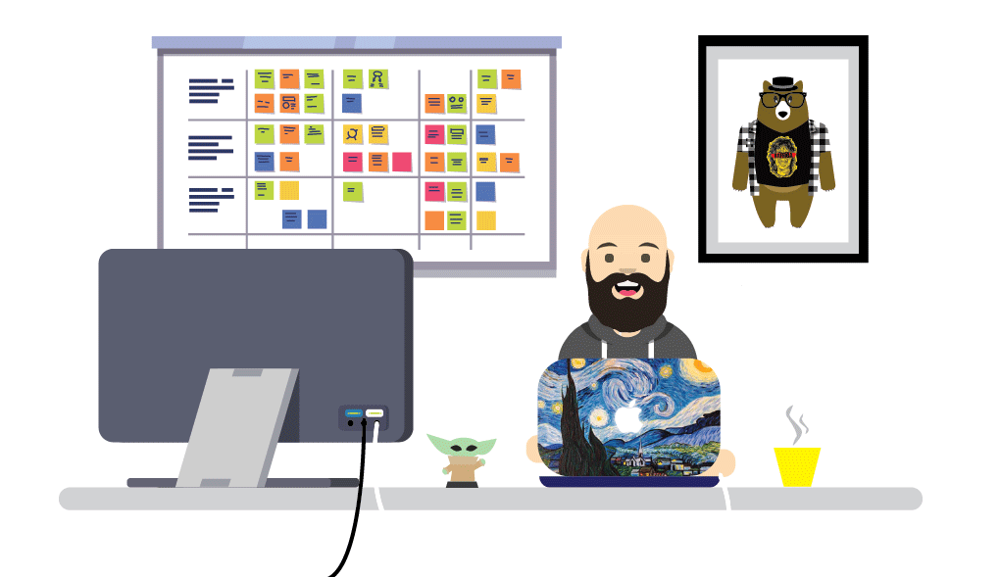

https://gist.github.com/DesignFront/4df70ca40f7a077ebbc8b4c39b4c943c

<!-- ### Hi there 👋 -->

<!--
**vindiv/vindiv** is a ✨ _special_ ✨ repository because its `README.md` (this file) appears on your GitHub profile.

Here are some ideas to get you started:

- 🔭 I’m currently working on ...
- 🌱 I’m currently learning ...
- 👯 I’m looking to collaborate on ...
- 🤔 I’m looking for help with ...
- 💬 Ask me about ...
- 📫 How to reach me: ...
- 😄 Pronouns: ...
- ⚡ Fun fact: ...
-->



<h1 align="center">Hi 👋, I'm Vincenzo</h1>
<h3 align="center">A passionate developer from Italia</h3>

:briefcase: @ [ArtProject](https://www.artproject.it)


My life riassumed in code:
```php
if(☕.isEmpty()) {
  keepCoding();
 }
 else {
  ☕.fill();
 }

```

<p align="left">  </p>

<!--<p align="left"> <a href="https://github.com/ryo-ma/github-profile-trophy"></a> </p>-->

<h3 align="left">Connect with me:</h3>
<p align="left">
<a href="https://instagram.com/vindiv82" target="blank"></a>
</p>

<h3 align="left">Languages and Tools:</h3>
<p align="left"> <a href="https://getbootstrap.com" target="_blank">  </a> <a href="https://www.w3schools.com/css/" target="_blank">  </a> <a href="https://git-scm.com/" target="_blank">  </a> <a href="https://www.w3.org/html/" target="_blank">  </a> <a href="https://www.adobe.com/in/products/illustrator.html" target="_blank">  </a> <a href="https://developer.mozilla.org/en-US/docs/Web/JavaScript" target="_blank">  </a> <a href="https://laravel.com/" target="_blank">  </a> <a href="https://www.linux.org/" target="_blank">  </a> <a href="https://mariadb.org/" target="_blank">  </a> <a href="https://www.mysql.com/" target="_blank">  </a> <a href="https://www.photoshop.com/en" target="_blank">  </a> <a href="https://www.php.net" target="_blank">  </a> <a href="https://postman.com" target="_blank">  </a> </p>

<center><p></p></center>

<!--<p>&nbsp;</p>-->
